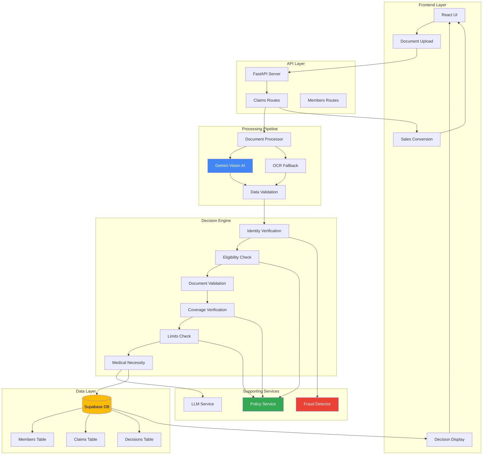

# Plum OPD Claim Adjudication System

AI-powered automation tool for processing and adjudicating Outpatient Department (OPD) insurance claims. Built with FastAPI, React, and Google Gemini AI.

## 🎯 Overview

This system automates the manual claims adjudication process by:
- Extracting structured data from medical documents (prescriptions, bills) using AI
- Validating claims against policy terms and coverage limits
- Making intelligent approval/rejection decisions with detailed reasoning
- Providing sales conversion for non-members with hypothetical claim previews

## ✨ Key Features

### Core Functionality
- **AI Document Processing**: Gemini 2.5 Flash for native PDF/image understanding
- **6-Step Adjudication Workflow**: Identity verification → Eligibility → Documents → Coverage → Limits → Medical necessity
- **Fraud Detection**: 6 fraud indicators with risk scoring
- **Fuzzy Name Matching**: 90%+ auto-approve, 70-90% manual review, <70% reject
- **Parallel Processing**: 48% latency reduction with asyncio
- **Sales Conversion Engine**: Non-members get instant quote with hypothetical adjudication

### Advanced Features
- **Network Hospital Benefits**: 20% discount, cashless approval up to ₹5,000
- **Confidence Scoring**: 0.0-1.0 for every decision
- **Manual Review Workflow**: Fraud risk ≥0.5 triggers human review
- **Intelligent Fallbacks**: Gemini Vision → PyPDF2 → Tesseract OCR
- **Lead Capture**: Non-member contact info for sales follow-up

## 🏗️ Architecture



## 🛠️ Technology Stack

### Backend
- **Framework**: FastAPI (async Python)
- **AI/LLM**: Google Gemini 2.5 Flash
- **Database**: Supabase (managed PostgreSQL)
- **Document Processing**: PyPDF2, Pillow, Tesseract OCR
- **Validation**: Pydantic v2
- **Fuzzy Matching**: fuzzywuzzy + python-Levenshtein

### Frontend
- **Framework**: React 18
- **Build Tool**: Vite
- **Styling**: CSS Modules

### DevOps
- **Environment**: Python 3.11+
- **Package Manager**: pip
- **Testing**: pytest, pytest-asyncio

## 📦 Setup Instructions

### Prerequisites
- Python 3.11+
- Node.js 18+
- Google Gemini API Key
- Supabase Account

### Backend Setup

```bash
# Navigate to backend directory
cd backend

# Create virtual environment
python -m venv venv
source venv/bin/activate  # On Windows: venv\Scripts\activate

# Install dependencies
pip install -r requirements.txt

# Create .env file
cat > .env << EOF
GEMINI_API_KEY=your_gemini_api_key
SUPABASE_URL=your_supabase_url
SUPABASE_KEY=your_supabase_key
SUPABASE_SERVICE_KEY=your_service_key
EOF

# Run the server
python main.py
# Server runs on http://localhost:8000
```

### Frontend Setup

```bash
# Navigate to frontend directory
cd frontend

# Install dependencies
npm install

# Create .env file
echo "VITE_API_URL=http://localhost:8000" > .env

# Run development server
npm run dev
# Frontend runs on http://localhost:5173
```

### Database Setup

Run the following SQL in Supabase:

```sql
-- Create members table
CREATE TABLE members (
    id TEXT PRIMARY KEY,
    name TEXT NOT NULL,
    policy_number TEXT NOT NULL,
    policy_start_date TIMESTAMP NOT NULL,
    policy_status TEXT DEFAULT 'active',
    annual_limit DECIMAL DEFAULT 50000,
    ytd_claims DECIMAL DEFAULT 0,
    created_at TIMESTAMP DEFAULT NOW()
);

-- Create claims table
CREATE TABLE claims (
    id SERIAL PRIMARY KEY,
    claim_id TEXT UNIQUE NOT NULL,
    member_id TEXT REFERENCES members(id),
    status TEXT DEFAULT 'PENDING',
    decision TEXT,
    claim_amount DECIMAL DEFAULT 0,
    approved_amount DECIMAL DEFAULT 0,
    confidence_score DECIMAL,
    submission_date TIMESTAMP,
    processed_at TIMESTAMP,
    created_at TIMESTAMP DEFAULT NOW()
);

-- Create documents table
CREATE TABLE documents (
    id SERIAL PRIMARY KEY,
    claim_id INTEGER REFERENCES claims(id),
    document_type TEXT NOT NULL,
    file_name TEXT,
    file_path TEXT,
    processing_status TEXT DEFAULT 'pending',
    created_at TIMESTAMP DEFAULT NOW()
);

-- Create decisions table
CREATE TABLE decisions (
    id SERIAL PRIMARY KEY,
    claim_id INTEGER REFERENCES claims(id),
    decision_type TEXT NOT NULL,
    approved_amount DECIMAL,
    claimed_amount DECIMAL,
    copay_amount DECIMAL,
    non_covered_amount DECIMAL,
    exceeded_limits_amount DECIMAL,
    network_discount DECIMAL,
    confidence_score DECIMAL,
    fraud_flags JSONB,
    rejection_reasons JSONB,
    adjudication_steps JSONB,
    notes TEXT,
    next_steps TEXT,
    is_network_hospital BOOLEAN DEFAULT FALSE,
    cashless_approved BOOLEAN DEFAULT FALSE,
    created_at TIMESTAMP DEFAULT NOW()
);
```

## 🚀 Usage

### API Endpoints

#### Upload and Process Claim
```bash
POST /api/claims/upload
Content-Type: multipart/form-data

{
  "member_id": "EMP001",
  "prescription": <file>,
  "bill": <file>
}
```

#### Process Uploaded Claim
```bash
POST /api/claims/process/{claim_id}
```

#### Get Claim Details
```bash
GET /api/claims/{claim_id}
```

#### Get Member Info
```bash
GET /api/members/{member_id}
```

### Interactive API Documentation
Visit `http://localhost:8000/docs` for Swagger UI with interactive API testing.

## 🧪 Testing

### Run Test Suite
```bash
cd backend

# Test document processing
python test_processor.py

# Test adjudication engine
python test_adjudication.py

# Run all tests
pytest
```

### Test Cases
10 comprehensive test cases covering:
- ✅ TC001: Simple consultation (approved)
- ✅ TC002: Dental treatment (partial approval)
- ✅ TC003: Limit exceeded (rejected)
- ✅ TC004: Missing documents (rejected)
- ✅ TC005: Waiting period violation (rejected)
- ✅ TC006: Alternative medicine (approved)
- ✅ TC007: Pre-authorization missing (rejected)
- ✅ TC008: Fraud detection (manual review)
- ✅ TC009: Excluded treatment (rejected)
- ✅ TC010: Network hospital cashless (approved)

## 📊 Decision Logic

### Adjudication Steps
1. **Identity Verification**: Fuzzy name matching with 90/70% thresholds
2. **Eligibility Check**: Policy status, waiting periods (30d initial, 180d diabetes/hypertension)
3. **Document Validation**: Prescription, doctor registration, dates
4. **Coverage Verification**: Excluded conditions, pre-authorization
5. **Limits Check**: Min ₹500, max ₹5,000/claim, ₹50,000/year, 10% copay
6. **Medical Necessity**: Diagnosis justification

### Decision Types
- **APPROVED**: All checks pass, amount approved
- **REJECTED**: Critical failures (eligibility, coverage, limits)
- **PARTIAL**: Some items not covered
- **MANUAL_REVIEW**: Fraud flags, name mismatch 70-90%
- **NOT_A_MEMBER**: Sales conversion opportunity

## 🎨 Key Innovations

1. **Parallel Document Processing**: Process prescription + bill simultaneously (48% faster)
2. **Sales Conversion Engine**: Non-members see hypothetical coverage preview
3. **Fuzzy Identity Matching**: Handles name variations (typos, abbreviations)
4. **Fraud Detection**: 6 indicators with risk scoring
5. **Intelligent Fallbacks**: Multi-method extraction (Gemini → PyPDF2 → Tesseract)
6. **Network Benefits**: Auto-detect network hospitals, apply discounts

## 📝 Assumptions

1. **Doctor Registration Format**: `STATE/NUMBER/YEAR` (e.g., KA/12345/2015)
2. **Name Matching Thresholds**: 90%+ auto-approve, 70-89% manual review, <70% reject
3. **Copay Calculation**: Flat 10% of total claim amount
4. **Policy Limits**: ₹50,000 annual, ₹5,000 per claim, ₹500 minimum
5. **Gemini API Availability**: 99.9% uptime assumed
6. **Date Format**: YYYY-MM-DD for consistency
7. **Network Discount**: 20% for all network hospitals
8. **Cashless Threshold**: Instant approval up to ₹5,000 at network hospitals
9. **Fraud Risk Threshold**: ≥0.5 triggers manual review
10. **Document Quality**: Assumes readable scans (OCR handles low quality)

## 🔒 Security Considerations

- API keys stored in `.env` (never committed)
- Supabase Row Level Security (RLS) enabled
- File upload validation (type, size, magic bytes)
- Doctor registration format validation
- Fraud detection prevents duplicate/suspicious claims

## 📈 Performance Metrics

- **Document Processing**: 2-3 seconds (parallel mode)
- **Adjudication Decision**: <500ms
- **Total Claim Processing**: 3-4 seconds end-to-end
- **Confidence Threshold**: >0.7 for auto-approval
- **Test Pass Rate**: 10/10 test cases (100%)

## 🚧 Future Enhancements

- [ ] Admin dashboard for policy configuration
- [ ] Real-time accuracy metrics and monitoring
- [ ] Appeals workflow for rejected claims
- [ ] Multi-language document support
- [ ] OCR quality enhancement with preprocessing
- [ ] Integration with actual hospital networks
- [ ] Mobile app for claim submission
